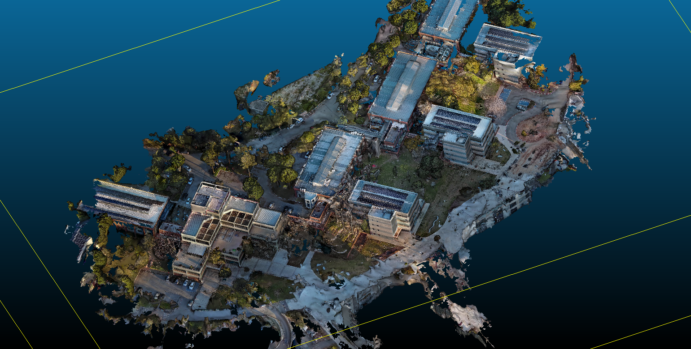
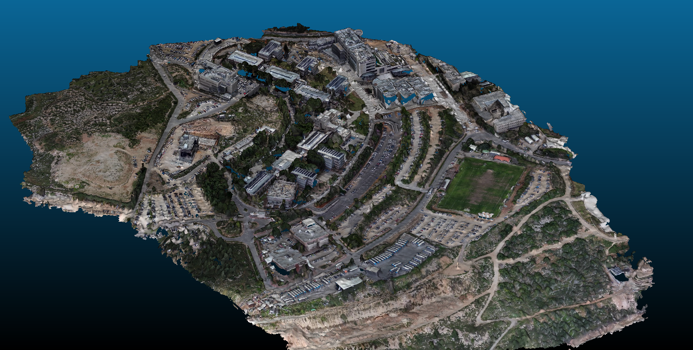

# Photogrammetry-ODM  
**Drone Video → Frames → OpenDroneMap (NodeODM) → 3D / Geo Outputs (Mesh, Point Cloud, Orthophoto, DSM, etc.)**  

This project provides a **repeatable** and **automated photogrammetry pipeline** using **OpenDroneMap (ODM)** through **NodeODM**, fully containerized with **Docker Compose**.

It supports:
- Extracting frames from drone videos (`ffmpeg`)
- Uploading frames to NodeODM
- Monitoring task progress
- Downloading full ODM outputs automatically
- Organizing results into clean timestamped run folders

---

# 1) What this project does (High Level)

Given a drone **video** (`.mp4` / `.mov`):

1. Extract frames using `ffmpeg`
2. Submit extracted images to **NodeODM** (via `pyodm`)
3. Poll the task until completion
4. Download all ODM results (orthophoto, DSM, mesh, point cloud, etc.)
5. Optionally copy key artifacts into `data/processed/...`

This repo is designed to be:
- **Repeatable**
- **Config-driven**
- **Cross-platform (Windows / Linux)**
- **Docker-based (minimal host setup)**

---

# 2) Needed Hardware (Recommended)

### Minimum workable (small projects)
- **CPU:** 6+ cores (12 threads recommended)
- **RAM:** 32 GB (64 GB recommended)
- **Storage:** SSD strongly recommended
- **GPU (optional):** NVIDIA CUDA GPU

### Smooth performance (medium-large datasets)
- **CPU:** 8–16 cores
- **RAM:** 64–128 GB
- **Storage:** NVMe SSD (100+ GB free per run)
- **GPU:** NVIDIA RTX-class GPU

> NodeODM works CPU-only. GPU can accelerate some steps, but ODM is often CPU/RAM bound.

---

# 3) Software Prerequisites (Versions Used)

## Host requirements (recommended runtime: Docker)

### Windows 11
- Windows 11
- **WSL2 enabled**
- **Docker Desktop** (WSL2 backend)
- NVIDIA WSL2 driver (only if using GPU)
- PowerShell (already included)

### Linux
- Docker Engine
- Docker Compose plugin (`docker compose`)
- Optional: `nvidia-container-toolkit` (for GPU)

---

## Inside the pipeline container
- **Python:** 3.11 (`python:3.11-slim`)
- **ffmpeg:** installed via apt
- **Pinned packages:**
  - `pyyaml==6.0.2`
  - `pydantic==2.10.6`
  - `requests==2.32.3`
  - `tqdm==4.67.1`
  - `python-dotenv==1.0.1`
  - `pyodm==1.5.9`

---

## NodeODM container
- `opendronemap/nodeodm:gpu`

---

# 4) Repository Layout (Project Structure)

```
Photogrammetry-ODM/
├─ docker-compose.yml
├─ docker/
│  ├─ pipeline/
│  │  ├─ Dockerfile
│  │  ├─ requirements.txt
│  │  └─ .dockerignore
│  └─ configs/
│     └─ defaults.yaml
├─ scripts/
│  ├─ setup_and_run_windows11.ps1
│  ├─ setup_and_run_linux.sh
│  ├─ run_pipeline.ps1
│  ├─ run_pipeline.sh
│  ├─ run_dji0004.ps1
│  └─ run_dji0004.sh
├─ src/
│  ├─ cli.py
│  ├─ configs/
│  │  └─ default.yaml
│  ├─ common/
│  │  ├─ config.py
│  │  ├─ logging.py
│  │  └─ paths.py
│  ├─ pipeline/
│  │  ├─ frames.py
│  │  ├─ odm_client.py
│  │  ├─ odm_task.py
│  │  └─ run.py
│  └─ utils/
│     ├─ hashing.py
│     └─ subprocess.py
├─ assets/
│  ├─ DJI0004.gif
│  ├─ DJI0004.png
│  ├─ DJI0449.gif
│  ├─ DJI0449.png
│  ├─ Barn.gif
│  └─ Barn.png
└─ commands.txt
```

---

# 5) Key Paths and Outputs

## Input videos
Place your drone videos here:

```
data/raw/videos/<your_video>.mp4
```

> Large videos are NOT stored in GitHub, so you must provide them locally.

---

## Outputs per run
Each run creates a unique `run_id`:

### Main run folder
```
runs/<run_id>/
runs/<run_id>/odm/
```

### Extracted frames (intermediate)
```
data/interim/frames/<run_id>/
```

### Processed summary outputs (optional)
```
data/processed/odm_results/<run_id>/
```

This folder copies important outputs (if they exist), such as:
- orthophoto (`.tif`)
- DSM / DTM
- point cloud (`.laz`)
- mesh (`.obj`, `.ply`)
- report (`report.pdf`)

---

# 6) Install & Setup

## Option A: Windows 11 (Docker Desktop + WSL2)

1. Install Docker Desktop
2. Enable:
   - **Use the WSL 2 based engine**
3. If using GPU:
   - Install NVIDIA driver that supports WSL2
   - Validate:
     ```powershell
     nvidia-smi
     ```

Optional helper script:
```powershell
powershell -ExecutionPolicy Bypass -File .\scripts\setup_and_run_windows11.ps1
```

---

## Option B: Linux

Run the helper setup script:

```bash
chmod +x scripts/setup_and_run_linux.sh
./scripts/setup_and_run_linux.sh
```

---

# 7) Configuration

## Main YAML configuration file
Default configuration:
```
src/configs/default.yaml
```

### Common settings to adjust
- `video.fps`
- `video.max_frames`
- `video.start_seconds`
- `video.duration_seconds`
- `odm.parallel_uploads`
- `odm.poll_seconds`
- `odm_options.*`

---

## NodeODM host selection (Multi-node support)
The pipeline reads an environment variable:

```
ODM_HOST=http://nodeodm:3000,http://nodeodm2:3000
```

The runner checks all NodeODM servers and selects the least-loaded one.

---

# 8) Step-by-Step Workflow (Recommended)

## Terminal #1 — Start NodeODM services
From repo root:

```powershell
docker compose up -d --build
```

This starts:
- NodeODM #1 → `http://localhost:3000`
- NodeODM #2 → `http://localhost:3001`
- Pipeline container image build (Python + ffmpeg + deps)

---

## Terminal #2 — Run a pipeline job

Put your video here:
```
data/raw/videos/Barn.mp4
```

Then run:

```powershell
docker compose run --rm pipeline python -m src.cli run --video data/raw/videos/Barn.mp4 --fps 1 --max-frames 300
```

Arguments:
- `--fps 1` → extract 1 frame/sec
- `--max-frames 300` → cap extracted frames (0 = unlimited)

---

## What happens during execution
1. Frames extracted via `ffmpeg`
2. Frames uploaded to NodeODM
3. Task runs on ODM backend
4. Progress is displayed with `tqdm`
5. Outputs downloaded into `runs/<run_id>/odm/`
6. Optional copy of key outputs into `data/processed/...`

---

# 9) Monitoring NodeODM (Recommended)

Run in a separate terminal.

## Health check
```powershell
curl.exe -s http://localhost:3000/info
```

## List tasks
```powershell
curl.exe -s http://localhost:3000/task/list
```

## Progress table (PowerShell)
```powershell
$tasks = curl.exe -s http://localhost:3000/task/list | ConvertFrom-Json

$tasks | ForEach-Object {
    $u = $_.uuid
    $info = curl.exe -s "http://localhost:3000/task/$u/info" | ConvertFrom-Json
    [pscustomobject]@{
        uuid     = $u
        code     = $info.status.code
        progress = $info.progress
        minutes  = "{0:N1}" -f ($info.processingTime / 60000)
        images   = $info.imagesCount
    }
} | Format-Table -Auto
```

Common NodeODM status codes:
- `10` = queued
- `20` = running

> The most reliable indicator is `progress` and NodeODM logs.

---

# 10) CLI Usage

## Help
```bash
docker compose run --rm pipeline python -m src.cli --help
```

---

## Minimal run
```bash
docker compose run --rm pipeline python -m src.cli run --video data/raw/videos/DJI0004.mp4
```

---

## Override extraction window
```bash
docker compose run --rm pipeline python -m src.cli run   --video data/raw/videos/Barn.mp4   --fps 2   --start-seconds 10   --duration-seconds 30
```

---

## Pass extra ODM options
```bash
docker compose run --rm pipeline python -m src.cli run   --video data/raw/videos/Barn.mp4   --odm-opt feature-quality=ultra   --odm-opt pc-quality=high   --odm-opt mesh-size=300000
```

---

## Disable processed-copy stage
```bash
docker compose run --rm pipeline python -m src.cli run --video data/raw/videos/Barn.mp4 --no-copy-processed
```

---

# 11) Script Reference (Recommended Shortcuts)

## Windows PowerShell scripts
### Run pipeline on any video
```powershell
.\scripts\run_pipeline.ps1 -VideoPath "data/raw/videos/Barn.mp4"
```

### Run DJI0004 preset
```powershell
.\scripts\run_dji0004.ps1
```

### Setup helper (first time)
```powershell
.\scripts\setup_and_run_windows11.ps1
```

---

## Linux scripts
### Run pipeline on any video
```bash
./scripts/run_pipeline.sh data/raw/videos/Barn.mp4
```

### Run DJI0004 preset
```bash
./scripts/run_dji0004.sh
```

### Setup helper (first time)
```bash
./scripts/setup_and_run_linux.sh
```

---

# 12) Troubleshooting (Common Problems)

## “Task not found” after submit
Usually caused by missing persistence volume.

NodeODM must persist tasks in:
- `/var/www/data`

This repo mounts volumes:
- `nodeodm_data:/var/www/data`
- `nodeodm2_data:/var/www/data`

Check:
```bash
docker volume ls
docker logs nodeodm --tail 200
```

---

## GPU not being used
Validate GPU works on host:
```bash
nvidia-smi
```

Validate Docker GPU passthrough:
```bash
docker run --rm --gpus all nvidia/cuda:12.1.0-base-ubuntu22.04 nvidia-smi
```

If that fails, NodeODM will still run CPU-only (slower).

---

## “Stuck” at low progress for a long time
ODM sometimes stays on one stage for a long time.

Monitor:
- CPU/RAM usage (Task Manager / htop)
- NodeODM logs:
  ```bash
  docker logs -f nodeodm
  ```

---

# 📌 Example Results (GIF + PNG)

Below are example outputs generated from this pipeline (found inside the `assets/` directory):

## DJI0004



---

## DJI0449



---

## Barn


---

# ✅ Summary

This project provides a clean **end-to-end automated ODM photogrammetry workflow**:

- Works from **drone video**
- Extracts frames automatically
- Runs ODM through NodeODM
- Downloads full results
- Stores clean run-based output folders
- Includes ready-to-show example renders (PNG + GIF)

---